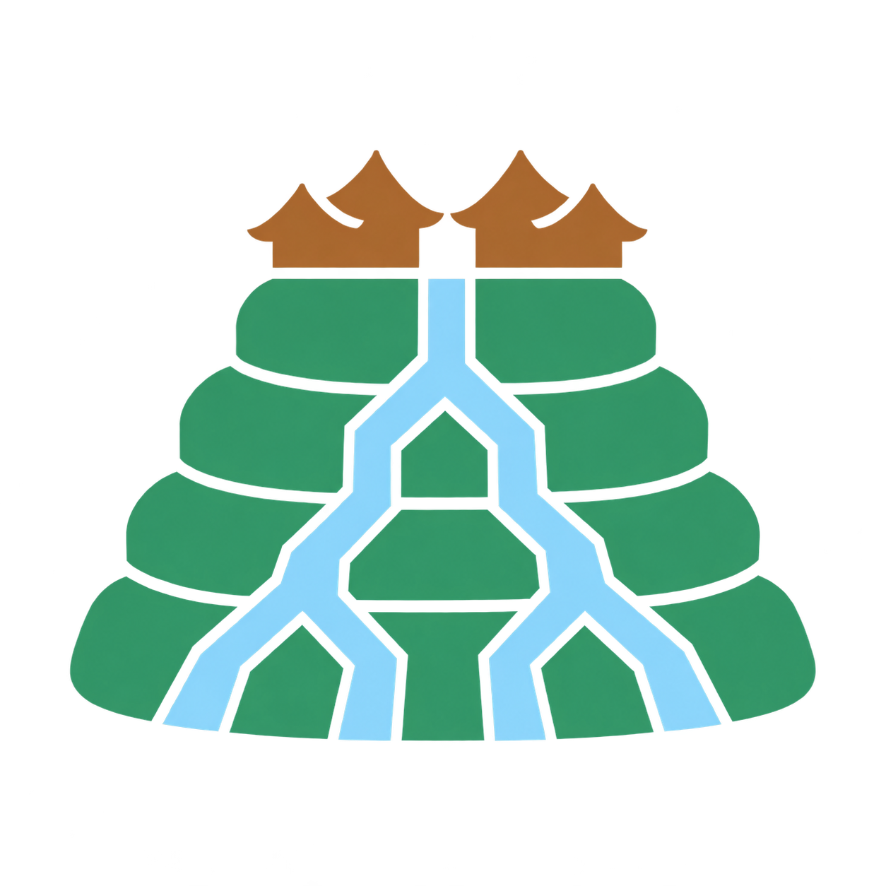

# AWIG OS

*An operating system with its own kernel. It follows a thousand-year-old way of governing.*

---

## Kernel status, 21 September 2026

| | Today |
|---|---|
| Architecture | x86-64, one processor |
| Runs without Linux | Yes |
| Boots in | QEMU (multiboot). Real hardware: not yet |
| Written in | C and assembly, about 11,600 lines, in [`code/src/body`](./code/src/body) |
| Memory | Physical, virtual and heap management, each checked at boot |
| User-mode isolation | Built. A program the kernel does not trust runs in ring 3 and crosses by one door; its trespass and its refusal are checked at boot |
| Scheduler | Preemptive, with threads and futex waits; it runs in the full build |
| Disk and network | ATA and virtio-net drivers; the network stack runs as a boxed worker. With no device attached the kernel says so and skips those acts |
| Standard Python on it | Yes, unmodified, in the full build |
| Same bytes on rebuild | Yes. The plain image is 65,588 bytes and repeated builds give one fingerprint (Debian, gcc 14.2.0, binutils 2.44) |
| Self-check | At every start. Plant a change and the matching check fails |
| What it is for | Every act passes a written rule and is recorded, refusals included |
| Licence and stage | GPLv3, pre-alpha |

**Build it and boot it.** On a Linux machine with `gcc`, `binutils`, Python 3 and `qemu-system-x86_64`, and nothing of ours installed:

    cd code/src/body
    ./build.sh . /tmp/awig-body
    qemu-system-x86_64 -cpu qemu64 -display none -no-reboot -m 256 -rtc base=utc -serial stdio -kernel /tmp/awig-body/body.img

Every check prints PASS or FAIL on the serial line, and the last line is `BODY-HALT`. This is the plain kernel; the full build, its numbers beside Linux, and everything that is not true yet are in [`STATUS.md`](./STATUS.md).

---

## 0. Read this first

Everything that can change something on a computer is an actor: a program, a driver, an AI, a person. AWIG OS is being built so that every actor is known, boxed and answerable. Until it runs, a program is only a file, and a file cannot act. When it runs, it acts only through written rules, and every yes and every no is written down with its reason.

All of it is kept in one book that is only ever added to. The one book does five jobs that are normally five separate systems:

1. The rulebook: what anyone may do.
2. The logbook: what anyone did, every yes and every no, each with the rule and the reason.
3. The constitution: how the rules themselves may change.
4. The institution: who holds which seat and which power right now.
5. The machine's blueprint: the kernel's own definition, from which its code is made.

Because it is one book, the five cannot disagree.

Today the book and its gate run, and our own kernel boots in a virtual machine with no Linux beneath it. Every program being born on the record with its rules sealed is being built now. What is true today is in [`STATUS.md`](./STATUS.md); what comes next is in [`ROADMAP.md`](./ROADMAP.md).

The rest of this section says the same thing for a careful reader.

Operating systems start from the machine and add rules on top: a permission here, a policy engine there, a log beside it all. AWIG OS starts from the other end. It begins with a written theory of legitimate authority, who may act, under which rule, granted by whom, and makes the machine an instance of that theory. Every act is a decision the machine records, citing the rule that allowed it. Every refusal is recorded the same way. A thing here is either information or an actor. Information never acts. An actor exists from the moment the system loads it, on the record, and can do only what its rules allow. The ground under all of it: record what happened, compute everything else.

Every organisation keeps five things in five places: a rulebook, an audit log, an institution, a constitution, and the machine that acts, and reads its own history from copies of copies. Here they are one record and five names for it. The record is the definitive; every view, every log, every screen is derived from it and can be thrown away and rebuilt, hash for hash. Fix the definitive and the derivative follows. One kind of rule governs everything the rules govern, from who may open a file to how the rules themselves may change, with no special language for anyone. An AI organisation lives inside it on the far side of one boundary: what it says stays unstructured, what the institution does is structured rows, and nothing crosses from the one to the other except by passing a rule.

What that is for, situation by situation, with a command under each: [`WHAT-THIS-IS-FOR.md`](./WHAT-THIS-IS-FOR.md). The decision you have to defend, the no nobody can produce, the contractor who left, the machine that was wiped, the AI you let in.

Each part of this has a precedent, and they are named here before you look for them. Capability systems (KeyKOS, EROS, seL4) decide by held authority instead of by user. Reference monitors (Flask, SELinux) separate the rule from the enforcement. Event-sourced systems rebuild state from a log. Drawbridge ran a whole Windows over a few dozen calls. What is ours is the composition and the direction: those systems decide whether an act is allowed; this one records under which rule, granted by whom, amended how, still in force, and rebuilds that answer from the record alone. Access is decided. Authority has a provenance.

The questions a careful reader asks next, one line each:

- **Is this an audit log?** A log is written after the act. Here the row is the act: the thing happens because the row exists, and a no costs a row exactly as a yes does.
- **Is this a blockchain?** No consensus, no token, one pen. Many records, each its own institution, exchanging signed receipts; no chain shared by all.
- **Is this SELinux, or capabilities?** Those answer "may this happen". This answers "under which rule, granted by whom, changed how, still in force", and can answer it for any day in the past.
- **Why a kernel, and not a layer on seL4 or Linux?** A layer hosted on another kernel has a third door it cannot close: the host's own. So the kernel is ours, it is written, and it boots: it does the twelve kinds of work the seam declares and nothing reaches the hardware another way. seL4 is the nearest precedent and its proofs are the bar. Section 2 of [`ARCHITECTURE.md`](./ARCHITECTURE.md).
- **Where is the AI?** An AI model is a file of numbers, and a file cannot act. What acts is the program that loads it, and here that program meets the world at two doors only. The doors are built and tested between two machines; nobody lives between them yet. [`STATUS.md`](./STATUS.md) says so.
- **Can data be deleted?** Not here. Content changes hands by a handover with a receipt; there is no destroy. What that means for personal data is an open contract and [`STATUS.md`](./STATUS.md) lists it under what is not true yet.
- **What is true today?** [`STATUS.md`](./STATUS.md), dated, machine by machine. Where it and the code disagree, the code is right.
- **What comes next?** [`ROADMAP.md`](./ROADMAP.md): what is being built now and what follows, in order, with no dates.

Four things a stranger would watch for, and where each stands: a kernel that boots without Linux and runs a program it does not trust (done in campaign 7: it boots in a virtual machine, refuses to start on a changed byte, and runs the standard Python interpreter as sealed content; you can build and boot the plain kernel from `code/src/body`; real hardware is campaign 9); a hostile security review (three rounds, findings and repairs on `STATUS.md`); an outside contributor landing something substantial (none yet); one system that is not AWIG OS using the same rules and record (none yet). When all four are true this page will say so.

The rest of this page is why. It starts with water.

## 1. Start with the water

Rain falls on a volcano in Bali. It runs down through black rock and forest, and by the time it reaches the rice terraces it has become the most political substance on the island. Everyone's field needs it. No one's field may take it all.

For about a thousand years, the farming communities of Bali have governed that water together. They are called **subak**. Their meeting places are water temples. Their method is deliberation. Their protocol is ritual. In 2012, UNESCO inscribed the subak system as a World Heritage of humanity.

Each subak, and each Balinese village, writes and keeps its own rulebook. The rulebook is called the ***awig-awig***.

An awig-awig is a constitution written by the community it governs. The people who live under the rules are the people who make them. It is written down, so any member can read it. It is amended in the open, by a known process, in front of everyone. It binds because it is shared, not because someone stronger imposed it.

Water flows through everyone's fields. Rules are written by everyone's hands. Decisions are made where everyone can see. That design kept a complex, life-critical, shared system alive for a millennium, through empires, colonisers and modernity, without ever being owned by anyone.

This project holds that the same design is the honest way to govern the most powerful shared flow of our own time: computation and AI.

## 2. What the philosophy asks of the machine

AWIG OS is an attempt to build that design into the foundation of a computer system. Not as a feature. As the ground.

Every deployment of AWIG OS writes and keeps its own machine-readable rulebook, its own awig-awig. The system does not tell you what your rules should be. It guarantees that your rules are yours, written, and real.

All rules in the system share one common, readable, executable format. There is no privileged syntax for privileged actors. What governs you can be read by you.

Like water through the terraces, every exercise of permission leaves a visible trace. Authority that leaves no trace does not run. The powerful are not asked to be good. They are structured to be seen.

This year the largest operating systems began to fence what an AI agent may touch: which folders, which apps, which network, granted once for the session, off until an administrator switches it on. AWIG OS has no switch. Every act, by an agent or a person, crosses one gate as its own decision, citing the written rule that allowed it, and the row of that decision is the act. An AI organisation inside it meets the world at two openings only, what it is asked and what it asks for, and nothing arriving at the second executes until a rule says so. The two openings are built and proven in test worlds. Making every program on the machine live in that box, born by a row with its rules sealed, is the campaign now under way.

AI inside AWIG OS lives as a governed community, not an oracle. It is bounded, inspectable, constitutional, and the human owner stands above the whole, the way subak members stand above their own institutions.

The commons stays common. This project takes no trademark, sells nothing, and is licensed so that no one, however large, can close it and sell it back to the world with the accountability stripped out. The license is this project's first rule: written down, binding on everyone, heaviest on the strongest. See [`LICENSING.md`](./LICENSING.md).

## 3. The name

This project is named in homage to the awig-awig and subak traditions of Bali and Lombok, Indonesia. The acknowledgment, and four standing commitments about the name, including that this project will never claim or assert any exclusive right over it, are kept whole at [`NAMING.md`](./NAMING.md). Corrections to how the heritage is described are welcome now and always.

## 4. How this project governs itself

A project about governance keeps its own awig-awig, visibly. [`GOVERNANCE.md`](./GOVERNANCE.md) records how decisions here are proposed, discussed, and made, and can be amended only by the process it describes. Decisions of consequence are recorded in the open, including rejections. A community that keeps its refusals honest keeps its acceptances meaningful.

Until a contributor community forms, the project runs as a single maintainer with a full written trace, and moves to community governance as participation grows, the way a rulebook grows with its village.

## 5. The machine

What this is for, situation by situation: [`WHAT-THIS-IS-FOR.md`](./WHAT-THIS-IS-FOR.md).

The technical design is in [`ARCHITECTURE.md`](./ARCHITECTURE.md): what AWIG OS is as software, how it is built, its rule engine, its AI organisation.

Two things run here, and neither is a product yet. The governing layer, in Python: the record, the gate, the rules and the views. And beneath it our own kernel, in C, with no Linux under it, which a stranger can build and boot in a virtual machine today. The governing layer was built first, so the rules ran and could be tested before any kernel existed; the kernel is tested against it, act for act. The design papers are the contracts both implement, and `STATUS.md` says what is true today.

The code you can run is in the [`code`](./code/) folder. The governing layer runs with Python 3 and nothing else (`cd code && python3 check.py`); the kernel under `code/src/body` builds with `gcc` and boots in `qemu`. The folder carries its own [`code/README.md`](./code/README.md), a fingerprint of every file in `code/RENDER-STAMP.json`, sixteen checks, and the program's own test suite. [`STATUS.md`](./STATUS.md) says in plain words what you can try today, what exists but is not public yet, what is only designed, and the one warning.

The theory it runs on is the [Open Governance Standard](https://github.com/kfkchau/Open-Governance-Standard), and under it the [Open Meta-Governance Standard](https://github.com/kfkchau/Open-Meta-Governance-Standard/): a kernel for governing rules themselves, rules about rules. Read them if that interests you. AWIG OS is that theory, running.

**Where this stands, 20 September 2026.** AWIG OS runs on its own kernel. Booted in a virtual machine with no Linux beneath it, it checks its own body, its record, its constitution and its keys before its first act, refuses to start on a changed byte of the kernel or of the interpreter it carries, runs the standard Python interpreter unmodified as sealed content, and opens a network connection only after its own record grants it. You can build and boot the plain kernel yourself from `code/src/body`; the commands are on [`STATUS.md`](./STATUS.md). Above it runs the governing layer, which you can check in three commands: `cd code && python3 seed_demo.py && python3 check.py && python3 run_public_suite.py` (Linux, stock Python; on Windows, WSL): one record as the only truth, every act a row citing its rule, refusals recorded the same way, the whole governing state rebuilt from the record alone, hash for hash; the record chained and sealed, keys as rows, no delete, the border governed, one machine's row another's receipt. The constitution says so, fifty-five amendments in. It is slower than Linux and the page prints by how much. It is narrow by design, it runs in a virtual machine only, and real cryptography is off until you install one library. Next: every program born on the record with its rules sealed at load, and a one-file installer that starts a real computer from a USB stick and deletes nothing.

## 6. Contributing

Code, architecture review, documentation, translation (Bahasa Indonesia especially), and critique of the governance model itself are all welcome. Read [`GOVERNANCE.md`](./GOVERNANCE.md) first. Substantial proposals follow a simple written flow: proposal, open discussion, recorded decision. Accepted or rejected, both are preserved. Contributions carry a Developer Certificate of Origin sign-off (see [`LICENSING.md`](./LICENSING.md)).

## 7. License

In short: the ideas travel free with attribution, and the code stays open forever, for everyone, no matter who touches it. The plain-language explanation is in [`LICENSING.md`](./LICENSING.md).

---

The farmers of the subak never asked whether ordinary people could govern something complex and vital. They wrote their rules and opened the water. The systems that govern your days have rulebooks too. Could you read them if you asked?

---

© Kelvin Chau, 2026
Named in homage to the *awig-awig* and *subak* traditions of Bali and Lombok, Indonesia.
Documentation licensed under [CC BY 4.0](https://creativecommons.org/licenses/by/4.0/); code under [GPLv3](https://www.gnu.org/licenses/gpl-3.0.html). See [`LICENSING.md`](./LICENSING.md).
For attribution, citation, or inquiries: kelvin@rootrebuilder.org · [https://au.linkedin.com/in/kfkchau](https://au.linkedin.com/in/kfkchau) · or open an issue here.
